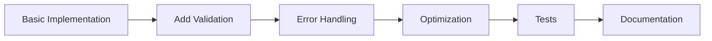
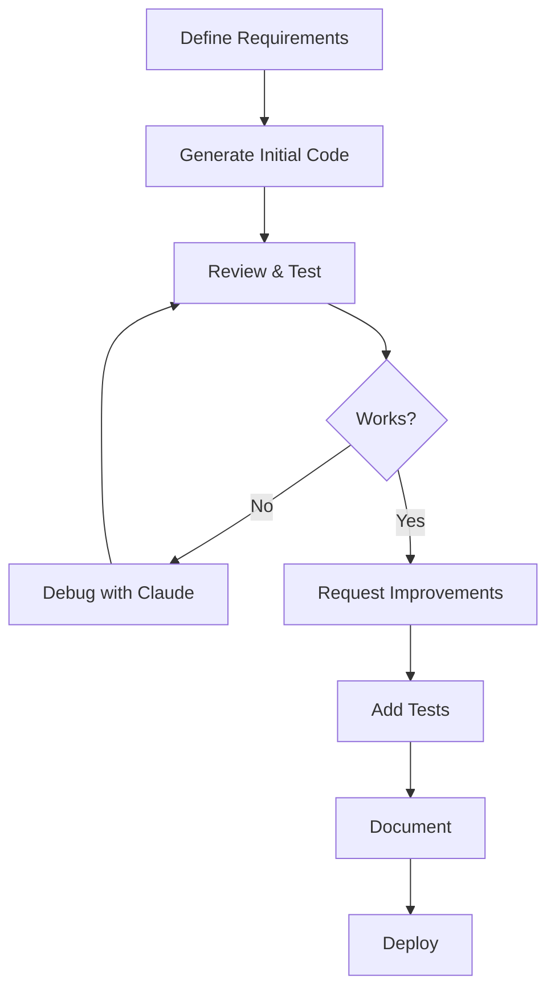

# How to Use Claude Web Effectively

This guide will help you maximize your productivity with Claude Code Web by teaching you effective communication strategies, workflow optimization, and advanced techniques.

## Core Principles of Effective Usage

### 1. Clear Communication

Claude understands natural language, but clarity improves results dramatically.

=== "Less Effective"

    ```
    "Make a login page"
    ```

=== "More Effective"

    ```
    "Create a React login page component with:
    - Email and password fields
    - Form validation (email format, password length)
    - Error message display
    - Loading state during authentication
    - Styled with Tailwind CSS"
    ```

### 2. Provide Context

The more context you provide, the better Claude can assist you.

**Include:**

- Programming language and version
- Framework and libraries being used
- Project structure or architecture
- Constraints (performance, browser support, etc.)
- Expected input/output formats

!!! example "Context-Rich Request"
    "I'm building a Node.js Express API (v4.18) with MongoDB. I need a user authentication middleware that:
    - Verifies JWT tokens from the Authorization header
    - Handles expired tokens gracefully
    - Attaches user data to the request object
    - Works with async/await pattern"

### 3. Iterative Refinement

Work in increments rather than asking for everything at once.



## Effective Prompting Techniques

### The SPEC Method

Use the SPEC framework for complex requests:

- **S**ituation: Describe the current state
- **P**roblem: Identify what needs to be solved
- **E**xpectation: Define the desired outcome
- **C**onstraints: Specify limitations or requirements

!!! example "SPEC in Action"

    **Situation**: "I have a Python script that processes CSV files with customer data"

    **Problem**: "It's taking 5 minutes to process 100,000 rows and consuming too much memory"

    **Expectation**: "Need to reduce processing time to under 1 minute and use less than 500MB RAM"

    **Constraints**: "Must use pandas, Python 3.9+, and maintain data integrity"

### Chain of Thought Requests

For complex problems, ask Claude to work through the solution step-by-step:

```plaintext
"Let's build a rate limiting system for an API. First, explain the approach you'd use,
then implement it step by step:

1. What data structure would work best?
2. How should we track request counts?
3. What happens when limits are exceeded?
4. How do we handle distributed systems?

After explaining, provide the implementation."
```

### Comparative Analysis

Ask Claude to evaluate different approaches:

```plaintext
"Compare these three approaches for state management in React:
1. Context API
2. Redux
3. Zustand

For each, discuss:
- Performance implications
- Learning curve
- Best use cases
- Integration complexity

Then recommend which to use for a medium-sized e-commerce app."
```

## Workflow Optimization

### The Development Cycle

An effective workflow with Claude Code Web:



### Session Management

**Start Each Session Right:**

```plaintext
"I'm working on [project name], a [description].
Tech stack: [languages/frameworks]
Current task: [what you're building]

Here's what we'll work on today:
1. [Specific goal 1]
2. [Specific goal 2]
3. [Specific goal 3]"
```

This sets context for the entire session.

### Code Sharing Best Practices

When sharing code with Claude:

=== "DO ✅"

    ```python
    # Share relevant code with context
    """
    This is my user authentication function.
    Issue: It doesn't handle case-insensitive emails.

    Current behavior: user@email.com ≠ User@Email.com
    Expected: Should treat both as the same user
    """

    def authenticate_user(email, password):
        user = db.query(User).filter(User.email == email).first()
        if user and user.verify_password(password):
            return user
        return None
    ```

=== "DON'T ❌"

    ```python
    # This doesn't work, fix it
    def authenticate_user(email, password):
        user = db.query(User).filter(User.email == email).first()
        if user and user.verify_password(password):
            return user
        return None
    ```

### Maintaining Context Across Conversations

**Reference Previous Work:**

```plaintext
"Earlier you helped me create the User model. Now I need to add a Profile model that:
- Has a one-to-one relationship with User
- Includes bio, avatar_url, and social_links fields
- Uses the same database pattern we established"
```

## Advanced Techniques

### Multi-Step Problem Solving

For complex tasks, break them down:

!!! example "Building a Feature"

    **Step 1: Architecture**
    ```
    "Let's design a real-time notification system.
    First, outline the architecture:
    - What components do we need?
    - How will they communicate?
    - What technologies should we use?"
    ```

    **Step 2: Implementation Plan**
    ```
    "Great! Now let's create an implementation plan.
    What order should we build these components in?"
    ```

    **Step 3: Build**
    ```
    "Let's start with the WebSocket server.
    Generate the code for that component."
    ```

### Code Review Requests

Get thorough code reviews:

```plaintext
"Review this code for:
1. Security vulnerabilities (especially SQL injection, XSS)
2. Performance bottlenecks
3. Code style and best practices
4. Potential edge cases not handled
5. Opportunities for refactoring

[paste code here]

For each issue, explain why it's a problem and suggest a fix."
```

### Learning-Oriented Interactions

Use Claude as a teacher:

```plaintext
"I want to understand dependency injection in Spring Boot.

1. First, explain the concept in simple terms
2. Show me a basic example
3. Then a more complex real-world example
4. Explain the benefits and trade-offs
5. Tell me common mistakes beginners make

After each section, I'll ask questions before moving to the next."
```

## Communication Patterns

### The Diagnostic Pattern

For debugging:

```plaintext
Symptom: [What's happening]
Expected: [What should happen]
Environment: [OS, versions, etc.]
Steps to reproduce: [Exact steps]
Error message: [Full error text]
Code: [Relevant code snippet]

I've already tried:
- [Attempted solution 1]
- [Attempted solution 2]
```

### The Exploration Pattern

For learning new technologies:

```plaintext
"I'm new to GraphQL and coming from a REST background.

Help me understand:
1. Core concepts and how they differ from REST
2. When to use GraphQL vs REST
3. A simple 'hello world' implementation
4. Common patterns and best practices
5. Pitfalls to avoid

Let's go through these one at a time."
```

### The Optimization Pattern

For improving existing code:

```plaintext
"Here's my current implementation: [code]

Current performance: [metrics]
Target performance: [goals]

Analyze:
1. What's causing the bottleneck?
2. What optimization strategies apply here?
3. Show me an optimized version
4. Explain the trade-offs
5. How can I measure the improvement?"
```

## Maximizing Response Quality

### Ask for Explanations

Don't just accept code—understand it:

```plaintext
"Before you write the code, explain:
- What approach you're taking
- Why this approach is better than alternatives
- What design patterns you're using
- Any potential drawbacks

Then provide the implementation with inline comments."
```

### Request Trade-Off Analysis

For architectural decisions:

```plaintext
"For this caching system, compare:

Option 1: Redis
Option 2: Memcached
Option 3: In-memory with Node.js

For each, discuss:
- Performance characteristics
- Operational complexity
- Cost implications
- Scalability limits
- Best use cases

Then recommend one for our specific scenario."
```

### Specify Code Style

Get code that matches your project:

```plaintext
"Generate a Python class following these conventions:
- Use type hints for all methods
- Follow PEP 8 style guide
- Include docstrings (Google style)
- Add property decorators where appropriate
- Use dataclasses if applicable
- Include error handling with custom exceptions"
```

## Common Pitfalls and Solutions

### Pitfall 1: Vague Requirements

❌ **Bad**: "Build a database"

✅ **Good**: "Create a PostgreSQL database schema for a blog platform with tables for users, posts, comments, and tags, including appropriate relationships and indexes"

### Pitfall 2: No Error Context

❌ **Bad**: "This crashes"

✅ **Good**: "This code throws a KeyError on line 15 when processing JSON data that's missing the 'user_id' field. Here's the full stack trace: [trace]"

### Pitfall 3: Ignoring Best Practices

❌ **Bad**: "Just make it work"

✅ **Good**: "Implement this following security best practices, with input validation, error handling, and logging"

### Pitfall 4: One Giant Request

❌ **Bad**: "Build a complete e-commerce platform with user auth, product catalog, shopping cart, payment processing, admin panel, and email notifications"

✅ **Good**: "Let's build an e-commerce platform. First, let's start with the user authentication system. I need [specific requirements]"

## Productivity Tips

### Use Templates for Common Tasks

Create personal templates for frequent requests:

**Code Review Template:**
```plaintext
Review this [language] code for:
- [Specific concern 1]
- [Specific concern 2]
- [Specific concern 3]

Code:
[paste here]

Provide:
1. Issues found (severity: high/medium/low)
2. Suggested fixes
3. Improved version of the code
```

**Testing Template:**
```plaintext
Generate [test type] tests for this [language] code using [framework]:

Code: [paste]

Requirements:
- Cover happy path and edge cases
- Include setup/teardown if needed
- Use descriptive test names
- Aim for [X]% code coverage
```

### Keyboard Shortcuts for Browsers

Speed up your workflow:

- `Ctrl/Cmd + A`: Select all (for copying code)
- `Ctrl/Cmd + C`: Copy
- `Ctrl/Cmd + V`: Paste
- `Ctrl/Cmd + F`: Find in page

### Use Code Blocks

Always use proper markdown formatting:

````markdown
```python
def example():
    return "Like this"
```
````

Not:
```
plain text code (harder to read)
```

## Measuring Your Effectiveness

Track these metrics to improve:

- **First-Try Success Rate**: How often Claude's initial response solves your problem
- **Iteration Count**: Average number of back-and-forth exchanges needed
- **Code Quality**: How much you need to modify Claude's suggestions
- **Learning Rate**: How quickly you can accomplish new tasks

!!! tip "Improvement Exercise"
    Every week, review one conversation where results weren't ideal. Identify:
    - What context was missing?
    - How could you have been more specific?
    - What follow-up questions would have helped?

## Quick Reference: Effective Prompts

| Goal | Effective Prompt Pattern |
|------|-------------------------|
| Code Generation | "Write a [language] [component type] that [does X] with [constraints]" |
| Debugging | "This code [behavior]. Expected: [correct behavior]. Environment: [details]. Code: [paste]" |
| Optimization | "Optimize this for [metric]. Current: [stats]. Target: [goals]. Code: [paste]" |
| Learning | "Explain [concept] starting with basics, then [advanced topic]. Include examples." |
| Architecture | "Design a system for [purpose] that handles [scale] with [constraints]" |
| Testing | "Write [test type] tests for [code] using [framework], covering [scenarios]" |
| Review | "Review this code for [specific concerns]. Provide issues, fixes, and improved version." |

## Next Steps

- Apply these techniques in your next session
- Review [Best Practices](best-practices.md) for coding repositories
- Explore [Research Use Cases](research-use-cases.md) for non-coding applications
- Master [Advanced Usage](advanced-usage.md) techniques

Remember: Effective usage improves with practice. The more you use Claude Code Web, the better you'll become at communicating your needs and getting optimal results.
