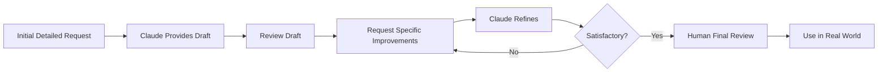

# Concrete Examples of Non-Code Usage

This guide provides real-world, detailed examples of using Claude Code Web for non-coding tasks. Each example includes the full interaction flow, demonstrating how to structure requests and iterate toward excellent results.

## Example 1: Academic Literature Review

### Scenario

Dr. Sarah Chen, a postdoctoral researcher in neuroscience, needs to synthesize recent literature on neuroplasticity in adult brains for a grant proposal background section.

### Initial Request

!!! example "First Prompt"
    ```
    "I'm writing a grant proposal on adult neuroplasticity interventions. I've identified
    12 key papers from 2020-2024. Help me create a structured literature review that:

    1. Synthesizes major findings
    2. Identifies methodological trends
    3. Highlights contradictions or debates
    4. Points to research gaps

    Here are the papers with key details:

    [Paper 1] Smith et al. (2023) - Environmental enrichment study, n=60, MRI
    findings showed 8% increase in hippocampal volume...

    [Paper 2] Johnson et al. (2022) - Exercise intervention, longitudinal study...

    [Continue for all 12 papers]

    Target: 1000 words, suitable for NIH grant background section"
    ```

### Claude's Response

Claude provides a well-structured synthesis organized by theme, with proper citations and identification of research gaps.

### Iteration 1: Refine Focus

!!! example "Follow-up Request"
    ```
    "This is excellent. Can you reorganize this to emphasize the mechanistic
    findings? My proposal focuses on molecular mechanisms, so I need the review
    to highlight:

    - BDNF pathways
    - Synaptic remodeling markers
    - Neurogenesis vs. synaptogenesis debates

    Keep the same papers but restructure around these mechanisms."
    ```

### Iteration 2: Add Critical Analysis

!!! example "Final Refinement"
    ```
    "Perfect. Now add a critical analysis paragraph that:

    1. Notes the limitation that most studies use animal models
    2. Points out the translation gap to humans
    3. Identifies that my proposed study addresses this gap by [specific approach]

    This sets up why my research is needed."
    ```

### Final Output

A polished 1000-word literature review that:

- Synthesizes 12 papers thematically
- Focuses on mechanisms relevant to the proposal
- Includes critical analysis
- Sets up the research gap the proposal addresses
- Uses appropriate scientific language for NIH reviewers

### Time Saved

- Traditional approach: 12-15 hours of reading, note-taking, and writing
- With Claude Code Web: 3-4 hours (reading papers + iterating with Claude)
- **Time savings: ~70%**

---

## Example 2: Technical Documentation

### Scenario

Alex Rodriguez, a DevOps engineer, needs to document a complex Kubernetes deployment process for their team's onboarding materials.

### Initial Request

!!! example "First Prompt"
    ```
    "Create comprehensive documentation for deploying our microservices application
    to Kubernetes. This will be used by new engineers onboarding to our team.

    Our stack:
    - 5 microservices (Node.js, Python, Go)
    - PostgreSQL database
    - Redis cache
    - Nginx ingress
    - Cert-manager for SSL
    - Helm for deployments
    - ArgoCD for GitOps

    The docs should cover:
    1. Prerequisites and local environment setup
    2. Understanding our architecture
    3. Step-by-step deployment process
    4. Common issues and troubleshooting
    5. How to verify deployment success
    6. Rollback procedures

    Audience: Junior engineers with basic Kubernetes knowledge
    Format: Markdown with code examples
    Tone: Clear and encouraging, not intimidating"
    ```

### Claude's Response

Claude generates a comprehensive 15-section documentation covering all requirements with code examples, diagrams, and troubleshooting tips.

### Iteration 1: Add Visuals

!!! example "Visual Enhancement Request"
    ```
    "Great start! Add mermaid diagrams for:

    1. System architecture showing all components and how they connect
    2. Deployment flow chart
    3. Troubleshooting decision tree

    Also, add 'boxes' or 'callouts' for:
    - Important warnings (things that could break the system)
    - Pro tips (best practices from experience)
    - Common mistakes (things new engineers often get wrong)"
    ```

### Iteration 2: Real-World Scenarios

!!! example "Practical Examples Request"
    ```
    "Add a 'Real-World Scenarios' section with walkthroughs for:

    1. 'It's 3 AM and the API service is down' - debugging under pressure
    2. 'I need to update the Node.js service' - safe update procedure
    3. 'Database migration just failed mid-deployment' - recovery steps
    4. 'SSL certificates expired' - emergency renewal

    For each scenario:
    - What you'll see (symptoms)
    - How to diagnose (commands to run)
    - Step-by-step fix
    - How to prevent it next time

    Base these on actual incidents we've had."
    ```

### Iteration 3: Onboarding Checklist

!!! example "Checklist Addition"
    ```
    "Create a 'First Week Checklist' that new engineers can use:

    Day 1:
    - [ ] Set up local development environment
    - [ ] Clone repositories
    - [ ] Get access credentials
    - [ ] etc.

    Day 2-3:
    - [ ] Deploy to development cluster
    - [ ] Make a small change and redeploy
    - [ ] etc.

    Day 4-5:
    - [ ] Shadow a deployment to staging
    - [ ] Practice rollback procedure in dev
    - [ ] etc.

    Make it actionable and measurable."
    ```

### Final Output

Professional technical documentation including:

- Clear step-by-step instructions
- Architecture diagrams
- Code examples for every step
- Troubleshooting decision trees
- Real-world scenario walkthroughs
- Onboarding checklist
- Pro tips from experienced team members

### Impact

- Onboarding time reduced from 3 weeks to 1 week
- Reduced Slack questions about deployment by 80%
- New engineers feel more confident earlier
- Documentation stays current (easy to update with Claude's help)

---

## Example 3: Business Analysis Report

### Scenario

Maria Santos, a business analyst at an e-commerce company, needs to create a quarterly performance report for the executive team.

### Initial Request

!!! example "Data Analysis Request"
    ```
    "Create an executive summary report for Q4 2024 performance.

    Our data:

    Revenue:
    - Q4 2024: $12.5M (up from $10.2M in Q4 2023)
    - Online: $8.2M (65.6%)
    - Retail: $4.3M (34.4%)

    Customer Metrics:
    - New customers: 45,000 (up 22%)
    - Customer retention: 68% (down from 72%)
    - Average order value: $87 (up from $79)
    - Customer lifetime value: $340 (down from $365)

    Product Performance:
    - Category A: $5.1M, 15% margin
    - Category B: $4.2M, 22% margin
    - Category C: $3.2M, 8% margin

    Marketing:
    - CAC (Customer Acquisition Cost): $42 (up from $35)
    - ROAS (Return on Ad Spend): 3.2x (down from 4.1x)
    - Email open rate: 24% (up from 21%)
    - Conversion rate: 3.8% (up from 3.2%)

    Create:
    1. Executive summary (key wins and concerns)
    2. Detailed analysis of each metric
    3. Trend identification
    4. Strategic recommendations
    5. Risk assessment

    Audience: C-suite executives (non-technical)
    Format: Professional business report
    Include: Visualizations suggestions"
    ```

### Claude's Response

Claude provides a comprehensive business report with insights, identifying positive trends (revenue growth, higher AOV) and concerns (retention drop, rising CAC).

### Iteration 1: Deeper Analysis

!!! example "Root Cause Analysis"
    ```
    "Excellent start. Now dig deeper into the concerning trends:

    1. Why might retention have dropped 4 percentage points?
    2. What's driving CAC increase while ROAS decreases?
    3. Why is Category C margin so low - should we discontinue it?
    4. Is the CLV decrease alarming given other positive metrics?

    For each, provide:
    - Likely causes (3-5 hypotheses)
    - What data we should collect to confirm
    - Immediate actions we could take
    - Long-term strategic implications

    Format as a 'Deep Dive Analysis' section."
    ```

### Iteration 2: Recommendations

!!! example "Action Plan Request"
    ```
    "Based on this analysis, create a 'Strategic Recommendations' section with:

    Immediate Actions (Next 30 days):
    - Specific, actionable items
    - Responsible parties
    - Expected impact
    - Resource requirements

    Short-term Initiatives (Q1 2025):
    - Strategic projects
    - Success metrics
    - Budget implications

    Long-term Strategy (2025):
    - Major strategic shifts
    - Investment areas
    - Growth opportunities

    Prioritize by impact and feasibility. Include risks for each recommendation."
    ```

### Iteration 3: Visualization Guidance

!!! example "Chart Specifications"
    ```
    "For each key metric, specify exactly what chart to create:

    Example format:
    Chart 1: Revenue Trend
    - Type: Line chart with two lines
    - X-axis: Quarters (Q1 2023 to Q4 2024)
    - Y-axis: Revenue ($M)
    - Lines: Total revenue + Online revenue
    - Annotations: Mark Q4 2024 with 'Record quarter'

    Create specifications for:
    1. Revenue and growth
    2. Customer acquisition and retention
    3. Profitability by category
    4. Marketing efficiency
    5. Customer lifetime value trend

    Include color recommendations and what story each chart tells."
    ```

### Final Output

A boardroom-ready report containing:

- Executive summary highlighting key wins and risks
- Metric-by-metric analysis with context
- Root cause analysis of concerning trends
- Data-driven hypotheses for investigation
- Prioritized recommendations with timelines
- Clear visualization specifications
- Risk assessment for each strategic direction

### Business Impact

- Executive meeting prep time: Reduced from 2 days to 4 hours
- More data-driven decision making
- Earlier identification of retention issue led to immediate action
- CFO used recommendations in board presentation

---

## Example 4: Survey Design and Analysis

### Scenario

Dr. James Kim, an organizational psychologist, needs to design an employee engagement survey and analyze the results.

### Phase 1: Survey Design

!!! example "Survey Design Request"
    ```
    "Design an employee engagement survey for a tech company (500 employees).

    Goals:
    1. Measure overall engagement
    2. Identify drivers of turnover
    3. Assess leadership effectiveness
    4. Evaluate work-life balance
    5. Gather improvement suggestions

    Requirements:
    - Takes 10-15 minutes to complete
    - Mix of Likert scales and open-ended questions
    - Validated constructs where possible
    - Anonymous but allow demographic breakdown
    - Benchmarkable against industry standards

    Provide:
    1. Survey structure and flow
    2. Exact questions with response options
    3. Scoring methodology
    4. Demographic questions (without compromising anonymity)
    5. Introduction text that encourages honest responses"
    ```

### Iteration: Refine Questions

!!! example "Question Validation"
    ```
    "Review the engagement questions for:

    1. Leading or biased wording
    2. Double-barreled questions
    3. Ambiguous language
    4. Cultural sensitivity
    5. Response bias potential

    Our team is globally distributed (US, Europe, Asia) and includes:
    - Engineers (60%)
    - Product/Design (25%)
    - Business functions (15%)

    Revise any problematic questions and explain the changes."
    ```

### Phase 2: Analysis Plan

!!! example "Analysis Strategy"
    ```
    "We've collected 387 responses (77% response rate). Create an analysis plan:

    1. Data cleaning steps
    2. Descriptive statistics to calculate
    3. How to identify patterns and trends
    4. Statistical tests to run
    5. Segmentation analysis (by department, tenure, etc.)
    6. Open-ended response coding approach
    7. Visualization strategy

    Provide Python code using pandas and scipy for the quantitative analysis."
    ```

### Phase 3: Results Interpretation

!!! example "Results Analysis"
    ```
    "Here are the results:

    Engagement Score: 3.8/5.0 (Industry avg: 4.0)

    By construct:
    - Job satisfaction: 4.1/5.0
    - Leadership trust: 3.2/5.0 ⚠️
    - Growth opportunities: 3.9/5.0
    - Work-life balance: 3.7/5.0
    - Team collaboration: 4.3/5.0

    By department:
    - Engineering: 3.9
    - Product: 4.0
    - Business: 3.4 ⚠️

    Turnover intent: 28% likely to leave in next year (Industry: 18%)

    Key correlations:
    - Leadership trust strongly predicts turnover intent (r=-0.67)
    - Growth opportunities moderately predicts engagement (r=0.52)

    Open-ended themes (top 5):
    - Communication from leadership (mentioned 87 times, negative)
    - Career development unclear (mentioned 64 times, neutral)
    - Good team culture (mentioned 112 times, positive)
    - Compensation concerns (mentioned 43 times, negative)
    - Remote work flexibility appreciated (mentioned 91 times, positive)

    Create:
    1. Executive summary for CEO
    2. Detailed findings report
    3. Action plan prioritized by impact
    4. Communication strategy for sharing results with employees"
    ```

### Final Deliverables

- Validated 45-question survey instrument
- Python analysis scripts
- Executive presentation (10 slides)
- Detailed findings report (25 pages)
- 90-day action plan with owners
- Employee communication plan

### Impact

- Identified leadership trust as key driver of turnover
- CEO implemented monthly all-hands Q&A sessions
- Launched mentorship program for career development
- 6-month follow-up showed engagement improved to 4.1/5.0
- Turnover intent decreased to 19%

---

## Example 5: Content Strategy Development

### Scenario

Lisa Thompson, content marketing manager at a SaaS company, needs to develop a comprehensive content strategy for 2025.

### Initial Request

!!! example "Strategy Framework"
    ```
    "Develop a content marketing strategy for our B2B SaaS product (project
    management tool for software teams).

    Current situation:
    - Blog: 2-3 posts/month, average 1,200 views/post
    - No email newsletter
    - Sporadic social media
    - Webinars: 1 per quarter
    - No gated content or lead magnets

    Goals:
    - Generate 500 MQLs (Marketing Qualified Leads) per month
    - Establish thought leadership in agile/project management
    - Support sales team with content assets
    - Build email list to 20,000 subscribers

    Budget: $120,000/year
    Team: Me + 1 writer + 1 designer

    Create a comprehensive strategy including:
    1. Content pillars and themes
    2. Content types and formats
    3. Publishing calendar framework
    4. Distribution strategy
    5. Metrics and KPIs
    6. Resource allocation"
    ```

### Claude's Response

Provides a framework with 4 content pillars, multiple content types, and distribution strategy.

### Iteration 1: Content Calendar

!!! example "Detailed Calendar"
    ```
    "Create a detailed Q1 2025 content calendar based on the strategy:

    For each piece of content, specify:
    - Title/topic
    - Content type (blog, ebook, video, etc.)
    - Content pillar it supports
    - Target keyword (for SEO)
    - Target audience segment
    - Publishing date
    - Distribution channels
    - Call-to-action
    - Owner (writer/designer/me)
    - Status tracking method

    Ensure content builds on itself and supports key campaigns:
    - January: New Year productivity
    - February: Remote team management
    - March: Q1 planning and retrospectives

    Format as a table that I can import to Asana."
    ```

### Iteration 2: Content Briefs

!!! example "Sample Content Briefs"
    ```
    "Create detailed content briefs for the top 3 pieces from the calendar:

    1. Flagship ebook: 'The Ultimate Guide to Agile Project Management'
    2. Blog series: 'Remote Team Productivity' (3 posts)
    3. Video content: 'Sprint Planning Workshop'

    For each, include:
    - Objective and success metrics
    - Target audience persona
    - Key messages and takeaways
    - Outline with section headers
    - SEO keywords to target
    - Internal/external links to include
    - Visual asset requirements
    - Promotion strategy
    - Conversion path

    These briefs should be detailed enough to hand to our writer."
    ```

### Iteration 3: Performance Tracking

!!! example "Metrics Dashboard"
    ```
    "Design a content performance tracking system:

    1. KPI framework
       - Leading indicators (traffic, engagement)
       - Lagging indicators (conversions, revenue)

    2. Metrics by content type
       - Blog posts: What to track?
       - Ebooks: Download-to-MQL conversion?
       - Videos: Watch time? Engagement?

    3. Dashboard structure
       - Daily/weekly/monthly views
       - What to track in Google Analytics
       - What to track in HubSpot
       - Custom calculations

    4. Reporting templates
       - Weekly snapshot for me
       - Monthly report for CMO
       - Quarterly business review format

    Provide:
    - Metrics definitions
    - Google Analytics custom report configs
    - Google Sheets template for dashboard
    - Benchmarks for our industry"
    ```

### Final Deliverables

- Comprehensive content strategy document (30 pages)
- Q1 detailed content calendar with 45 content pieces
- 3 detailed content briefs ready for production
- Performance tracking dashboard
- Budget allocation spreadsheet
- Team workflow and approval process

### Results After 6 Months

- MQLs: Increased to 380/month (target: 500)
- Email list: Grew to 14,500 subscribers
- Blog traffic: 3.5x increase
- Ebook: 2,100 downloads, 18% conversion to MQL
- Sales team using content in 85% of deals

---

## Example 6: Policy Document Creation

### Scenario

Marcus Johnson, HR director, needs to create a comprehensive remote work policy for a company transitioning to hybrid work.

### Initial Request

!!! example "Policy Development"
    ```
    "Create a comprehensive remote/hybrid work policy for our company.

    Context:
    - Tech company, 200 employees
    - Previously fully in-office
    - Post-pandemic, want to offer flexibility
    - Have offices in NYC and Austin
    - Teams: Engineering, Sales, Marketing, Operations

    Policy should address:
    1. Eligibility (who can work remotely)
    2. Work arrangements (fully remote, hybrid options)
    3. Equipment and home office setup
    4. Communication expectations
    5. Performance evaluation
    6. Security and data protection
    7. Tax and legal implications
    8. International work restrictions
    9. Office space allocation
    10. Collaboration and in-person requirements

    Tone: Professional but friendly, clear and unambiguous
    Format: Policy document suitable for employee handbook
    Include: FAQs section"
    ```

### Iteration 1: Legal Review Prep

!!! example "Legal Considerations"
    ```
    "Enhance the policy with specific legal considerations:

    1. Add sections on:
       - State employment law compliance
       - Workers' compensation for home offices
       - Tax implications of working across state lines
       - ADA accommodations in remote settings
       - FLSA compliance (exempt vs non-exempt remote workers)

    2. Include disclaimer language
    3. Add acknowledgment form for employees to sign
    4. Note where we need state-specific variants

    We operate in: CA, NY, TX, FL, WA

    Format with clear headings for our legal team to review."
    ```

### Iteration 2: Implementation Guide

!!! example "Rollout Plan"
    ```
    "Create an implementation guide for rolling out this policy:

    1. Communication timeline
       - Announcement approach
       - Town hall talking points
       - Manager briefing materials
       - FAQ for employees

    2. Application process
       - Request form template
       - Approval workflow
       - Criteria for approval/denial
       - Appeal process

    3. Technology requirements
       - VPN setup
       - Collaboration tools
       - Security requirements
       - IT support resources

    4. Manager training
       - Managing remote teams
       - Performance evaluation
       - Maintaining culture
       - Handling policy violations

    5. Transition timeline
       - Pilot program (first 2 months)
       - Feedback collection
       - Policy adjustment
       - Full rollout

    Make this actionable for our HR and IT teams."
    ```

### Final Package

- 18-page remote work policy document
- State-specific addendums for CA and NY
- Employee FAQ (25 questions)
- Manager's guide to remote work (12 pages)
- Implementation timeline and checklist
- Communication templates
- Remote work request and approval forms
- IT setup guide for remote workers

### Outcome

- Smooth policy rollout with 92% employee approval
- 68% of employees chose hybrid arrangements
- No major legal or security incidents
- Employee satisfaction increased 15%
- Able to recruit talent from wider geographic area

---

## Example 7: Grant Proposal Budget Narrative

### Scenario

Dr. Elena Vasquez, principal investigator, needs to write a detailed budget justification for an NSF grant proposal.

### Request and Response

!!! example "Budget Justification"
    ```
    "Write a comprehensive budget narrative for this NSF research grant:

    Project: AI for early detection of plant diseases
    Duration: 3 years
    Total budget: $675,000

    Budget breakdown:

    Year 1: $235,000
    - PI (12% effort): $15,000
    - Co-PI (8% effort): $9,000
    - Postdoc (100% effort): $58,000
    - PhD student (50% effort): $28,000
    - Fringe benefits (32%): $35,200
    - Equipment (drone + sensors): $45,000
    - Travel (conferences): $8,000
    - Field site costs: $15,000
    - Materials & supplies: $12,000
    - Publication costs: $4,000
    - Indirect costs (45%): $105,800

    Years 2-3: Similar with salary increases

    Write budget justification that:
    1. Explains necessity of each item
    2. Justifies amounts requested
    3. Links to specific aims
    4. Addresses cost-effectiveness
    5. Explains why items can't be covered by institution
    6. Follows NSF guidelines

    Make it compelling to reviewers while being factual."
    ```

Claude provides detailed justifications for each budget line item, connecting them to specific research activities and explaining why each expenditure is essential for project success.

---

## Key Patterns Across Examples

### Common Success Factors

1. **Specific Initial Requests**: All examples start with detailed context and clear goals
2. **Iterative Refinement**: Multiple rounds improve quality significantly
3. **Domain Context**: Providing field-specific information yields better results
4. **Audience Specification**: Knowing the end audience shapes the output
5. **Format Guidance**: Specifying desired format saves revision time

### Typical Workflow



### Time Investment vs. Savings

| Example | Total Time with Claude | Traditional Time | Savings |
|---------|----------------------|------------------|---------|
| Literature Review | 3-4 hours | 12-15 hours | 70% |
| Technical Docs | 6-8 hours | 20-24 hours | 65% |
| Business Report | 4-5 hours | 12-16 hours | 70% |
| Survey Design | 8-10 hours | 30-40 hours | 75% |
| Content Strategy | 12-15 hours | 40-50 hours | 70% |
| Policy Document | 6-8 hours | 24-32 hours | 75% |
| Grant Budget | 2-3 hours | 8-10 hours | 70% |

**Average time savings: ~70%**

## Best Practices from These Examples

1. **Front-load the context**: Spend time on a detailed first prompt
2. **Iterate deliberately**: Each follow-up request should have a specific goal
3. **Specify the audience**: Always mention who will read/use the output
4. **Request formats**: Be explicit about structure and formatting needs
5. **Use domain language**: Frame requests in the terminology of your field
6. **Ask for alternatives**: "Show me two approaches" yields better insights
7. **Validate with expertise**: Use Claude to accelerate, your judgment to validate

## Next Steps

- Review [Research Use Cases](research-use-cases.md) for more context on research applications
- Study [Effective Usage](effective-usage.md) to improve your prompting
- Explore [Advanced Usage](advanced-usage.md) for complex workflows

Remember: These examples show real-world applications. Adapt the patterns to your specific needs, and don't hesitate to iterate until you get exactly what you need.
