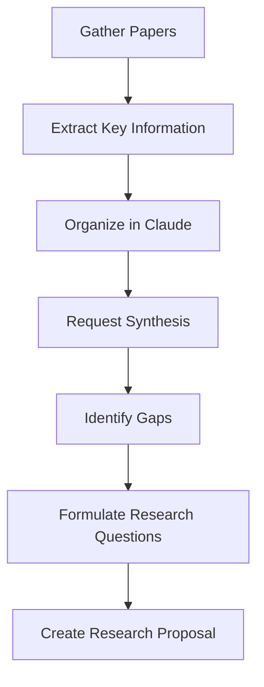
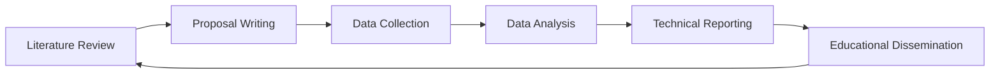

# Research-Related Use Cases Beyond Coding

While Claude Code Web excels at coding tasks, its capabilities extend far into research, analysis, and knowledge work. This guide explores five key research use cases where Claude Code Web provides exceptional value.

## 1. Literature Review and Synthesis

### Overview

Claude Code Web can help researchers process academic papers, synthesize findings, and identify research gaps across large volumes of literature.

### Capabilities

- **Paper Summarization**: Extract key findings from research papers
- **Comparative Analysis**: Compare methodologies across multiple studies
- **Gap Identification**: Identify unexplored areas in existing research
- **Citation Management**: Help organize and format citations
- **Trend Analysis**: Identify emerging themes in a field

### Practical Applications

#### Systematic Literature Review

!!! example "Research Request"
    ```
    "I'm conducting a systematic review on machine learning in healthcare.

    Help me create:
    1. Search query strings for academic databases
    2. Inclusion/exclusion criteria
    3. Data extraction template
    4. Quality assessment framework
    5. PRISMA flow diagram structure

    Focus area: ML for early disease detection (2019-2024)"
    ```

#### Multi-Paper Synthesis

```
"I've read 5 papers on quantum computing applications. Here are the abstracts:

[Paper 1 abstract]
[Paper 2 abstract]
[Paper 3 abstract]
[Paper 4 abstract]
[Paper 5 abstract]

Create a synthesis table comparing:
- Research objectives
- Methodologies used
- Key findings
- Limitations
- Future research directions

Then write a 500-word synthesis highlighting:
- Common themes
- Contradictions or disagreements
- Evolution of ideas
- Research gaps"
```

#### Research Gap Analysis

```
"Based on this literature review of neural network architectures for NLP:

[Summary of reviewed papers]

Identify:
1. What questions remain unanswered?
2. What methodologies haven't been tried?
3. What combinations of approaches might be novel?
4. What practical applications need more research?
5. What theoretical foundations need strengthening?

Suggest 3 specific research questions that could contribute to the field."
```

### Workflow Example



### Best Practices

- **Provide full abstracts** rather than just titles for better analysis
- **Specify your research question** to get focused insights
- **Request structured outputs** (tables, bullet points) for easier reference
- **Iterate on synthesis** by asking follow-up questions
- **Verify claims** by checking against original sources

---

## 2. Data Analysis and Interpretation

### Overview

Claude Code Web can assist with analyzing research data, interpreting statistical results, and creating data visualizations.

### Capabilities

- **Statistical Analysis**: Help choose and interpret statistical tests
- **Data Cleaning**: Generate scripts for data preprocessing
- **Visualization**: Create charts and graphs code
- **Pattern Recognition**: Identify trends and anomalies
- **Result Interpretation**: Explain what statistical results mean

### Practical Applications

#### Experimental Data Analysis

!!! example "Data Analysis Request"
    ```
    "I have experimental data from a psychology study (N=150):

    Variables:
    - Independent: Teaching method (3 groups: A, B, control)
    - Dependent: Test scores (continuous, 0-100)
    - Covariates: Age, prior knowledge score

    Help me:
    1. Choose appropriate statistical test
    2. Check assumptions (normality, homogeneity)
    3. Generate Python code for analysis (scipy/statsmodels)
    4. Interpret results
    5. Create publication-ready visualizations
    6. Write results section for paper

    Data summary:
    Group A: mean=75, SD=12, n=50
    Group B: mean=82, SD=10, n=50
    Control: mean=68, SD=14, n=50"
    ```

#### Survey Data Analysis

```
"Analyze this Likert scale survey data:

Research question: Does job satisfaction correlate with remote work frequency?

Survey items (5-point Likert):
- Job satisfaction (5 items, α=0.89)
- Remote work frequency (1-5: never to always)
- Work-life balance (3 items, α=0.82)
- Organizational commitment (4 items, α=0.91)

Sample: 300 employees

Tasks:
1. Recommend analysis approach
2. Generate R code for:
   - Descriptive statistics
   - Correlation matrix
   - Multiple regression
   - Mediation analysis (work-life balance as mediator)
3. Create visualizations
4. Interpret findings for academic paper"
```

#### Qualitative Data Coding

```
"Help me code qualitative interview data:

Research topic: User experience with AI assistants
Interviews: 20 semi-structured interviews, transcribed
Current themes I've identified:
- Trust concerns
- Efficiency gains
- Learning curve
- Integration challenges

Tasks:
1. Suggest additional potential themes based on my descriptions
2. Create a codebook structure
3. Provide coding guidelines for research assistants
4. Suggest inter-rater reliability methods
5. Help develop theoretical framework linking themes"
```

### Statistical Consulting Example

```
"I ran a t-test and got p=0.048. My advisor says this is 'marginally significant.'

Context:
- Study: Effect of meditation on stress (n=30 per group)
- Result: t(58)=2.03, p=0.048, Cohen's d=0.52
- Groups: Meditation vs. wait-list control
- DV: Cortisol levels (continuous)

Questions:
1. How should I interpret p=0.048?
2. Is the effect size meaningful?
3. What about statistical power?
4. Should I report confidence intervals?
5. How to write this up avoiding p-value misinterpretation?
6. What would reviewers likely ask about this result?"
```

### Best Practices

- **Share data structure** and summary statistics, not just final results
- **Explain research context** for appropriate analysis recommendations
- **Request code with comments** for reproducibility
- **Ask for assumption checks** to ensure valid analysis
- **Interpret in context** of your specific research question

---

## 3. Grant and Proposal Writing

### Overview

Claude Code Web can accelerate grant writing, help structure research proposals, and ensure alignment with funding requirements.

### Capabilities

- **Proposal Structuring**: Organize ideas into coherent proposals
- **Literature Integration**: Synthesize background sections
- **Methodology Design**: Develop detailed research methods
- **Timeline Creation**: Build realistic project timelines
- **Budget Justification**: Articulate resource needs
- **Impact Statements**: Craft compelling broader impact narratives

### Practical Applications

#### Research Proposal Development

!!! example "Proposal Request"
    ```
    "Help me develop a research proposal for NSF funding:

    Topic: Novel approach to biodegradable plastics using bacterial enzymes

    Requirements:
    1. Intellectual Merit section (2 pages)
    2. Broader Impacts section (1 page)
    3. Research methodology (3 pages)
    4. Timeline (2 years)
    5. Expected outcomes

    Background:
    - Current biodegradable plastics have X limitation
    - Our preliminary data shows Y
    - We propose to test Z hypothesis

    Start with helping me refine the specific aims."
    ```

#### Specific Aims Page

```
"Critique and improve my NIH R01 Specific Aims page:

[Paste current draft]

Evaluate:
1. Does the opening hook grab attention?
2. Is the knowledge gap clear and significant?
3. Are aims logically connected?
4. Is the innovation clear?
5. Is the expected impact compelling?
6. Does it fit one page with appropriate detail?

Provide:
- Critique of current version
- Revised version with track changes explanations
- Suggestions for strengthening each section"
```

#### Grant Budget Justification

```
"Write budget justification for these requested items:

Project: 3-year study on climate change impacts on coral reefs

Personnel:
- PI (15% effort, 3 years): $45,000/year
- Postdoc (100% effort, 3 years): $55,000/year
- Graduate student (50% effort, 3 years): $30,000/year

Equipment:
- Underwater imaging system: $75,000
- Water quality sensors (10x): $25,000

Travel:
- Field site visits (Australia, 2x/year): $30,000/year
- Conference presentations: $5,000/year

Justify each in terms of:
- Necessity for project success
- How it contributes to specific aims
- Why amount requested is appropriate
- Cost-effectiveness considerations"
```

#### Literature Review for Proposals

```
"Create a compelling literature review for a grant proposal:

Topic: Using AI to predict and prevent hospital readmissions
Audience: Healthcare research funding agency

Structure:
1. Problem significance (with statistics)
2. Current approaches and limitations
3. Knowledge gaps
4. How our approach addresses gaps
5. Potential impact

Length: 1500 words
Style: Authoritative but accessible
Include: Recent citations (2020-2024) and key foundational works

Key papers to integrate: [list]"
```

### Proposal Timeline Example

```
"Create a detailed research timeline:

Project: Development of quantum-resistant cryptography algorithms
Duration: 3 years
Funding: $750,000

Aims:
1. Theoretical framework development (Months 1-12)
2. Algorithm implementation and testing (Months 6-24)
3. Real-world deployment pilot (Months 18-36)
4. Performance evaluation and optimization (Months 24-36)

Include:
- Major milestones
- Deliverables
- Decision points
- Risk mitigation strategies
- Personnel assignments
- Publication/dissemination timeline

Format: Gantt chart structure + narrative"
```

### Best Practices

- **Understand funding agency priorities** and mention them
- **Provide preliminary data** to strengthen credibility
- **Request multiple iterations** to refine language
- **Ask for reviewer perspective**: "What questions would a reviewer have?"
- **Align with review criteria** specific to the funding mechanism

---

## 4. Technical Documentation and Reporting

### Overview

Create comprehensive technical reports, research documentation, and scientific manuscripts with Claude Code Web's assistance.

### Capabilities

- **Manuscript Drafting**: Structure and write research papers
- **Methods Sections**: Detail experimental procedures
- **Results Reporting**: Present findings clearly
- **Figure Legends**: Write descriptive captions
- **Technical Reports**: Document complex technical work
- **Protocol Development**: Create detailed experimental protocols

### Practical Applications

#### Scientific Manuscript Writing

!!! example "Manuscript Request"
    ```
    "Help me write the Discussion section for a research paper:

    Study: Machine learning prediction of protein structures

    Key findings:
    - Our model achieved 92% accuracy (previous best: 85%)
    - Works with limited training data
    - Computational efficiency improved 10x
    - Novel attention mechanism was key innovation

    Include:
    1. Interpretation of results
    2. Comparison with previous work
    3. Limitations of our study
    4. Future research directions
    5. Broader implications for structural biology

    Target journal: Nature Methods
    Word limit: 1200 words
    Tone: Confident but balanced"
    ```

#### Methods Section Development

```
"Write a detailed Methods section:

Experiment: CRISPR-Cas9 gene editing in mouse embryos

Protocol:
- Mouse strain: C57BL/6J
- sgRNA design: [details]
- Cas9 protein source: [vendor]
- Microinjection parameters: [specifics]
- Embryo culture conditions: [details]
- Genotyping approach: [PCR conditions]
- Statistical analysis: [tests used]

Requirements:
1. Sufficient detail for replication
2. Cite relevant protocols
3. Justify key methodological choices
4. Include ethical approval statement
5. Describe quality control measures
6. Follow journal guidelines for Nature Protocols"
```

#### Results Presentation

```
"Help me present these results clearly:

Experiment: A/B test of website redesign
Sample: 10,000 users (5,000 per group)
Duration: 30 days

Metrics:
                Control    Treatment   p-value
Click-through   12.3%      15.8%      <0.001
Conversion      3.2%       4.1%       0.003
Avg. time       4:23       5:12       0.018
Bounce rate     42%        38%        0.031

Additional findings:
- Effect stronger for mobile users
- Benefit increased over time (learning curve)
- No difference in customer satisfaction scores

Write:
1. Results paragraph for paper
2. Suggested visualizations
3. Statistical reporting (APA format)
4. Interpretation bullets
5. Limitations to note"
```

#### Figure Legends

```
"Write comprehensive figure legends:

Figure 1: Western blot showing protein expression across conditions
- 4 lanes: Control, Treatment A, Treatment B, Positive control
- Protein of interest: ~65 kDa band
- Loading control: β-actin at 42 kDa
- Replicate: Representative of n=3 experiments

Figure 2: Bar graph of quantified protein levels
- Y-axis: Relative protein expression (normalized to control)
- X-axis: Treatment conditions
- Error bars: SEM
- Significance: *p<0.05, **p<0.01 (one-way ANOVA)
- n=3 independent experiments

Create publication-ready legends following Cell journal style."
```

### Technical Report Structure

```
"Create an outline for a technical report:

Project: Solar panel efficiency optimization system
Audience: Engineering team + management
Purpose: Document system design and performance

Required sections:
1. Executive summary
2. Background and motivation
3. System architecture
4. Implementation details
5. Performance evaluation
6. Cost-benefit analysis
7. Recommendations
8. Technical appendices

For each section, provide:
- Key points to cover
- Appropriate detail level
- Suggested visualizations
- Page length estimate

Total length target: 40-50 pages"
```

### Best Practices

- **Specify target journal/venue** for appropriate style
- **Provide data/results** for accurate reporting
- **Request multiple versions** for different audiences
- **Ask for citation formatting** in required style
- **Iterate on technical accuracy** before final version

---

## 5. Educational Content Creation

### Overview

Develop educational materials, tutorials, and learning resources for teaching complex topics or training others.

### Capabilities

- **Curriculum Development**: Design course structures
- **Lecture Materials**: Create presentations and notes
- **Tutorial Writing**: Develop step-by-step guides
- **Assessment Design**: Generate quizzes and exam questions
- **Explanation Simplification**: Make complex topics accessible
- **Interactive Examples**: Create hands-on learning materials

### Practical Applications

#### Course Curriculum Design

!!! example "Curriculum Request"
    ```
    "Design a 12-week undergraduate course curriculum:

    Course: Introduction to Bioinformatics
    Level: Junior/Senior undergraduates
    Prerequisites: Intro Biology, Intro Programming (Python)
    Class: 3 hours/week (2 hr lecture + 1 hr lab)

    Create:
    1. Week-by-week topic breakdown
    2. Learning objectives for each week
    3. Suggested readings and resources
    4. Lab assignments (practical skills)
    5. Assessment strategy (exams, projects, etc.)
    6. Course project ideas

    Balance: 60% concepts, 40% hands-on programming
    Include: Modern topics like ML in genomics, not just foundational methods"
    ```

#### Tutorial Development

```
"Create a comprehensive tutorial:

Topic: Setting up a reproducible data science workflow
Audience: PhD students in social sciences (minimal programming background)
Length: 2-hour workshop

Cover:
1. Version control with Git/GitHub
2. Project organization best practices
3. Environment management (conda/venv)
4. Jupyter notebooks for analysis
5. Sharing code and data

For each section:
- Learning objectives
- Step-by-step instructions with screenshots
- Common pitfalls and solutions
- Practice exercises
- Additional resources

Format: Markdown document suitable for workshop website"
```

#### Exam Question Generation

```
"Generate exam questions for molecular biology course:

Topic: DNA Replication
Bloom's Taxonomy levels: Mix of remember, understand, apply, analyze

Question types needed:
- 5 multiple choice (4 options each)
- 3 short answer (2-3 sentences)
- 1 problem-solving question
- 1 critical thinking essay prompt

Difficulty: Undergraduate level (2nd year)

Requirements:
- Clear, unambiguous wording
- Plausible distractors for MC questions
- Includes diagram interpretation
- Tests conceptual understanding, not just memorization
- Provide answer key with explanations"
```

#### Concept Explanation at Multiple Levels

```
"Explain neural networks at three different levels:

Level 1: High school student (no calculus)
- Use analogies and everyday examples
- Focus on intuition
- 200 words

Level 2: Undergraduate CS student
- Include mathematical concepts
- Basic training process
- Code snippets
- 500 words

Level 3: Graduate researcher
- Technical depth
- Architecture variations
- Training dynamics
- Current research frontiers
- 1000 words

For each level:
- Appropriate terminology
- Relevant examples
- Suggested follow-up topics"
```

#### Interactive Learning Materials

```
"Design an interactive learning module:

Topic: Statistical hypothesis testing
Format: Jupyter notebook
Audience: Graduate students in experimental psychology

Include:
1. Theory sections with markdown explanations
2. Worked examples with code
3. Interactive visualizations (matplotlib/plotly)
4. Practice problems with solution cells
5. Real dataset for hands-on analysis
6. Comprehension check questions

Structure:
- Part 1: Null hypothesis significance testing
- Part 2: p-values and interpretation
- Part 3: Effect sizes and confidence intervals
- Part 4: Common mistakes and how to avoid them

Provide:
- Complete notebook code
- Sample dataset
- Instructor notes
- Learning objectives"
```

### Educational Video Script

```
"Write a script for a 10-minute educational video:

Topic: How CRISPR-Cas9 gene editing works
Audience: General public (high school education level)
Platform: YouTube

Structure:
1. Hook (first 30 seconds)
2. Problem introduction (1 min)
3. What is CRISPR? (2 min)
4. How it works (4 min)
5. Applications (2 min)
6. Ethical considerations (30 sec)
7. Conclusion and call-to-action (30 sec)

Requirements:
- Conversational tone
- No jargon without explanation
- Suggest visual aids for each section
- Include moments for graphics/animations
- Engaging storytelling
- Scientifically accurate but accessible

Format:
[Timestamp] [Visual description] | [Narration]"
```

### Best Practices

- **Know your audience** and their background knowledge
- **Specify learning objectives** for focused content
- **Request scaffolding** from simple to complex
- **Include formative assessments** to check understanding
- **Ask for multiple examples** at different difficulty levels
- **Integrate active learning** opportunities

---

## Integrating Research Use Cases

### Cross-Use Case Workflow

Many research projects benefit from combining these use cases:



### Example: Complete Research Project Workflow

1. **Literature Review**: Survey existing work on topic
2. **Proposal Writing**: Secure funding for research
3. **Protocol Development**: Design experimental methods
4. **Data Analysis**: Process and interpret results
5. **Manuscript Writing**: Publish findings
6. **Educational Content**: Create teaching materials from research

### Time-Saving Benefits

Typical time savings when using Claude Code Web for research:

| Task | Traditional Time | With Claude | Savings |
|------|-----------------|-------------|---------|
| Literature synthesis | 20 hours | 8 hours | 60% |
| Statistical code | 5 hours | 1 hour | 80% |
| Grant writing draft | 40 hours | 20 hours | 50% |
| Methods section | 6 hours | 2 hours | 67% |
| Tutorial creation | 15 hours | 6 hours | 60% |

*Note: Times are estimates and include iteration and human review*

## Best Practices Across All Research Use Cases

### 1. Provide Rich Context

Always share:

- Your research field and specific domain
- Target audience or publication venue
- Constraints (word limits, format requirements)
- Relevant background information

### 2. Iterate and Refine

Research is iterative:

- Start with rough drafts
- Ask for improvements
- Request alternative approaches
- Refine based on feedback

### 3. Verify and Validate

Claude Code Web is a tool, not a replacement for expertise:

- Check statistical recommendations
- Verify citations exist and are relevant
- Validate technical accuracy
- Review for field-specific conventions

### 4. Combine with Human Expertise

Best results come from human-AI collaboration:

- Use Claude for drafting and structuring
- Apply your domain expertise for validation
- Leverage Claude's breadth, your depth
- Iterate based on expert feedback

### 5. Document Your Process

For reproducibility and transparency:

- Keep records of prompts and responses
- Note where AI assistance was used
- Follow journal/funding agency disclosure requirements
- Maintain version control of documents

## Next Steps

- Explore [Concrete Non-Code Examples](non-code-examples.md) for detailed walkthroughs
- Review [Effective Usage](effective-usage.md) for better prompting techniques
- Check [Advanced Usage](advanced-usage.md) for sophisticated workflows

Remember: These research use cases are most powerful when combined with your expertise and critical thinking. Claude Code Web accelerates and enhances your research process but doesn't replace scholarly judgment.
